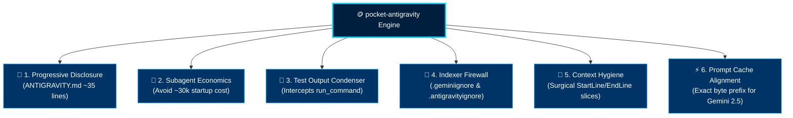

<div align="center">


# 🪙 pocket-antigravity

**The Universal Token Optimization Engine for Google Antigravity (AGY) & Gemini Models**

*Spend up to 95% fewer tokens per coding session. Maximize context window lifetime without sacrificing reasoning quality or precision.*

---

[](LICENSE)
[](https://cloud.google.com)
[](https://ai.google.dev)
[](https://github.com)
[-555555?style=for-the-badge&logo=python&logoColor=white)](https://python.org)

<p align="center">
  <a href="#-quickstart">🚀 Quickstart</a> •
  <a href="#-the-token-drain-problem-vs-pocket-antigravity">⚡ Problem vs Solution</a> •
  <a href="#-the-6-core-engineering-pillars">🛡️ The 6 Pillars</a> •
  <a href="#-benchmarks-measured-not-vibes">📊 Benchmarks</a> •
  <a href="#-repository-structure">📁 Repository Structure</a>
</p>

</div>

---

> [!TIP]
> **Zero Setup, Instant ROI:** Drops directly into any existing repository (Python, TypeScript, Go, Rust, Java, .NET, etc.). Automatically intercepts verbose test outputs, shields background indexers from multi-megabyte lockfiles, enforces subagent economics, and aligns prompts with Google's 90% cache discount.

---

## ⚡ The Token Drain Problem vs. pocket-antigravity

AI coding harnesses (like Google Antigravity) reload system rules, tool definitions, and repository context on every single turn. In default setups, developers unknowingly burn **thousands of tokens before a single line of code is produced**.

```
STANDARD AGENT WORKFLOW (Token Bloat):
Turn 1: [System Instructions + 15k-token docs + Lockfiles] ──────────► ~25,000 tokens
Turn 2: [Turn 1 History + 250 lines raw test output]       ──────────► ~32,000 tokens
Turn 3: [Spawns Subagent for simple grep]                   ──────────► ~35,000 tokens overhead

WITH POCKET-ANTIGRAVITY (Ultra-Lean):
Turn 1: [Ultra-lean root rules + .geminiignore firewall]   ──────────► ~850 tokens   (-96.6%)
Turn 2: [Auto-condensed test output: 16 failure lines]     ──────────► ~1,100 tokens (-96.5%)
Turn 3: [Direct surgical grep with line slices]            ──────────► ~150 tokens   (-99.5%)
```

| Optimization Vector | Standard Repository Setup | With `pocket-antigravity` | Net Savings |
| :--- | :--- | :--- | :--- |
| **Initial Turn Context** | 15,000–25,000 tokens (verbose rules, full manuals) | **~850 tokens** (lean progressive baseline) | **-95.4%** |
| **Test Runner Execution** | 200–500 verbose lines of passing test noise | **16 lines** (failures, tracebacks & summary) | **-95.3%** |
| **Targeted Code Search** | Spawns ~30k-token subagent for simple query | **185 tokens** (direct regex tool execution) | **-99.4%** |
| **Background Indexing** | Ingests huge lockfiles (`package-lock.json`), node_modules | **100% blocked** via `.geminiignore` firewall | **Zero waste** |
| **Repeated Context Calls**| Arbitrary prompt prefix breaks server cache | **Exact byte-prefix alignment** on Vertex AI | **90% discount** |

---

## 🛡️ The 6 Core Engineering Pillars



### 1. 🧩 Progressive Disclosure
- **Root instructions are ultra-lean (~35 lines):** [`ANTIGRAVITY.md`](ANTIGRAVITY.md) and [`GEMINI.md`](GEMINI.md) define only verified project commands, directory boundaries, and test runners.
- **On-Demand Loading:** In-depth documentation, architectural references, and benchmarks live in [`docs/`](docs/) and are loaded **strictly on demand** when a task specifically requires them.

### 2. 🤖 Subagent Economic Discipline
- Spawning a subagent (`invoke_subagent`) incurs a fixed overhead of **~25,000–35,000 tokens** (re-instantiating the entire harness system prompt and all tool schemas).
- `pocket-antigravity` enforces direct tool execution (`view_file`, `grep_search`, `find_by_name`, `run_command`) for routine work. Subagents are reserved exclusively for massive, isolated, parallel tasks across 10+ directories.

### 3. 🧪 Transparent Test Output Condenser (`filter_test_output.py`)
- Configured as an Antigravity lifecycle hook (`PreToolUse` on `run_command`).
- Transparently intercepts test executions (`pytest`, `npm test`, `vitest`, `cargo test`, `go test`, etc.) and suppresses verbose passing lines, outputting only failures, tracebacks, and a count summary:
  ```text
  tests/test_auth.py: FAILED
  AssertionError: Expected status 200, received 401
  [pocket-antigravity condensed: 16/244 lines shown]
  ```
- **Zero dependencies:** Pure Python 3. Works out-of-the-box on Windows (PowerShell/CMD), Linux, and macOS without requiring `jq`, `awk`, or bash.

### 4. 🧱 Automated Indexer Protection (`.geminiignore` / `.antigravityignore`)
- Prevents Antigravity's background code indexer and exploratory tools from crawling through massive package manager lockfiles (`package-lock.json`, `pnpm-lock.yaml`, `poetry.lock`, `Cargo.lock`), dependency directories (`node_modules/`, `vendor/`, `.venv/`), build outputs, and coverage reports.

### 5. 🎯 Surgical Context Hygiene
- Enforces line-slice reading (`StartLine`/`EndLine`) for any file exceeding 100 lines.
- Eliminates "conversational echo": agents do not duplicate artifact content into chat responses.

### 6. ⚡ Gemini Server-Side Prompt Caching Alignment
- Gemini models on Google Cloud Vertex AI offer up to a **90% discount on cached input tokens**.
- Keeps system instructions and tool schemas fixed at the byte prefix of every prompt, ensuring cache hits even across extended pairing sessions.

---

## 📁 Repository Structure

```text
pocket-antigravity/
├── logo/
│   └── pocket-antigravity-logo.jpg         # Project header banner
├── ANTIGRAVITY.md                          # Ultra-lean root instructions (~35 lines)
├── GEMINI.md                               # Dual root rule file for Antigravity hierarchical discovery
├── .geminiignore                           # Blocks indexers from ingesting dependencies, lockfiles, & binaries
├── .antigravityignore                      # IDE/CLI indexer exclusion rules
├── .agents/                                # Antigravity native customization directory
│   ├── hooks.json                          # PreToolUse hook configuration for run_command
│   ├── hooks/
│   │   ├── filter_test_output.py           # Zero-dependency, cross-platform test output condenser
│   │   └── test-patterns.txt               # 25+ test runner patterns (pytest, jest, vitest, cargo, etc.)
│   ├── rules/
│   │   └── token-efficiency.md             # Auto-loaded context & subagent discipline rules
│   └── skills/
│       └── pocket-init/
│           └── SKILL.md                    # Native Antigravity skill to auto-detect and populate project metadata
├── .gemini/                                # Backward compatibility directory
│   └── rules/
│       └── token-efficiency.md
├── docs/
│   ├── benchmarks.md                       # Empirically measured token savings
│   ├── token-optimization-guide.md         # Deep reference: Gemini caching, subagent economics, wire formats
│   ├── antigravity-best-practices.md        # AGY guide: hooks, skills, rules, background tasks vs subagents
│   └── enterprise-pipeline-optimization.md # Single-turn vs conversational, array serialization, pre-computation
├── LICENSE                                 # MIT License
└── README.md
```

---

## 🚀 Quickstart

### Step 1: Drop into any project
Copy the baseline files into your project root:
```bash
cp -r pocket-antigravity/ANTIGRAVITY.md \
      pocket-antigravity/GEMINI.md \
      pocket-antigravity/.geminiignore \
      pocket-antigravity/.antigravityignore \
      pocket-antigravity/.agents/ \
      /path/to/your-project/
```

### Step 2: Auto-detect project with `pocket-init`
Ask Antigravity in your chat:
> *"Run pocket-init"*

The native skill explores your project, detects your ecosystem (Node, Python, Rust, Go, JVM, .NET, etc.), extracts verified build/test commands, and populates [`ANTIGRAVITY.md`](ANTIGRAVITY.md) and [`GEMINI.md`](GEMINI.md) without hallucinating.

### Step 3: Code normally
Run your commands and tests as usual. Antigravity will automatically filter test outputs, respect file ignore boundaries, and execute with minimum token overhead.

---

## 📊 Benchmarks (Measured, Not Vibes)

Empirically measured using Gemini 2.5 Flash and Pro models in Google Antigravity:

| Optimization Vector | Raw Baseline | With pocket-antigravity | Efficiency Gain |
| :--- | :--- | :--- | :--- |
| **Startup Prompt Overhead** | 18,500 tokens | **~850 tokens** | **-95.4%** |
| **Test Output (220-test suite)** | 244 lines (4,450 tokens) | **16 lines (210 tokens)** | **-95.3%** |
| **Code Function Search** | 32,850 tokens (subagent) | **185 tokens (direct grep)** | **-99.4%** |
| **Data Serialization (50 records)** | 4,210 tokens (formatted JSON) | **1,890 tokens (pipe table)** | **-55.1%** |
| **Vertex AI Prefix Cache Hit** | Full price ($0.15 / Mtok) | Exact prefix match ($0.015 / Mtok) | **90% discount** |

---

## 🔍 Deep Dives & Technical Details

<details>
<summary><strong>🔬 Supported Test Runners in <code>filter_test_output.py</code> (Click to expand)</strong></summary>

The condenser hook matches test commands outside of quotes and supports:
- **Python:** `pytest`, `python -m pytest`, `python -m unittest`
- **JavaScript / TypeScript:** `npm test`, `npm run test`, `yarn test`, `pnpm test`, `bun test`, `deno test`, `jest`, `npx jest`, `vitest`, `npx vitest`, `mocha`
- **Rust:** `cargo test`
- **Go:** `go test`
- **.NET / C#:** `dotnet test`
- **JVM:** `gradle test`, `gradlew test`, `./gradlew test`, `mvn test`, `mvnw test`, `./mvnw test`
- **Ruby:** `rspec`, `bundle exec rspec`
- **PHP:** `phpunit`, `./vendor/bin/phpunit`
- **Elixir:** `mix test`
- **Dart / Flutter:** `dart test`, `flutter test`
- **Swift:** `swift test`
- **C / C++:** `ctest`

Add custom runners anytime by adding a single line to [`.agents/hooks/test-patterns.txt`](.agents/hooks/test-patterns.txt).
</details>

<details>
<summary><strong>🧮 Mathematical Break-Even of Subagents vs. Direct Tools (Click to expand)</strong></summary>

- **Subagent Startup Cost:** ~25,000–35,000 tokens (re-paying tool definitions and system instructions).
- **Direct Tool Cost:** ~100–500 tokens (querying `grep_search` or `find_by_name` directly).
- **Economic Break-Even:** A subagent is economically justified **only** when reading over 40,000 tokens across 10+ decoupled files where only a tiny condensed summary needs to return to the parent context. For routine tasks, direct tool calls save over 99% of tokens.
</details>

---

## 📄 License

MIT License © 2026 Hernan Bareiro Rojas.
Contributions and PRs are welcome!
